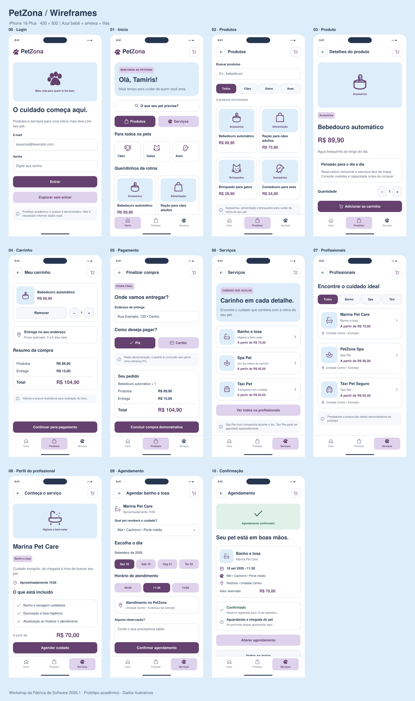

# 🐾 PetZona — Estudo de Caso Acadêmico de UX/UI

O **PetZona** foi desenvolvido como projeto final do **Workshop da Fábrica de Software 2026.1**.

O desafio fez parte do processo de avaliação para ingresso na equipe de **UX/UI do projeto Adm4All**, permitindo colocar em prática os conhecimentos apresentados durante o workshop.

## ✨ Nova prototipação — em desenvolvimento

A interface do **PetZona** está passando por uma nova etapa de evolução visual. A imagem abaixo apresenta uma prévia da direção adotada para as novas telas, incluindo experiências de produtos, serviços e confirmação de agendamento.

  

> **Status:** a nova prototipação de alta fidelidade ainda está em desenvolvimento no Figma. Esta imagem representa uma prévia e poderá receber ajustes até a conclusão do fluxo navegável.

---

### Wireframes e prévia navegável

Os materiais de trabalho estão disponíveis em [prototipos/wireframes](./prototipos/wireframes/COMECE-AQUI.md): **18 cenários**, incluindo as dez telas principais, login e variações de compra, Spa Pet e Táxi Pet. A base é **430 × 932 px**, com azul bebê, ameixa e lilás.

| Material | Acesso |
|---|---|
| Guia para abrir as telas e importar no Figma | [Comece aqui](./prototipos/wireframes/COMECE-AQUI.md) |
| Prévia interativa em HTML | [Petzona-preview.html](./prototipos/wireframes/Petzona-preview.html) |
| Telas individuais em SVG | [18 cenários](./prototipos/wireframes/telas-svg) |
| Gerador de camadas nativas com Auto Layout | [Plugin do Figma](./prototipos/wireframes/plugin) |
| Correção de alinhamento do importador | [Guia de correção](./prototipos/wireframes/CORRIGIR-DESALINHAMENTO.md) |
| Código-fonte e verificações | [Fontes](./prototipos/wireframes/fontes) |

Para experimentar a prévia, baixe o repositório em **Code → Download ZIP**, extraia-o e abra `prototipos/wireframes/Petzona-preview.html` no navegador. O GitHub exibe o código do HTML; a experiência interativa é executada ao abrir o arquivo localmente. Compras, pagamentos e reservas são apenas demonstrações.

> **Em desenvolvimento:** a prévia permite comparar larguras de 360, 390, 430 e 768 px. A correção do importador passou por verificações de código e testes estruturais, mas ainda precisa de inspeção visual no Figma. A adaptação das telas e as conexões também devem ser revisadas antes da publicação do protótipo final.

---

## 📌 Visão geral

| Item | Descrição |
|---|---|
| **Tipo de projeto** | Acadêmico — desafio final de workshop |
| **Área** | UX/UI Design |
| **Segmento** | Produtos e serviços para pets |
| **Responsabilidade** | Pesquisa exploratória, estruturação do fluxo e prototipação |
| **Ferramentas** | Figma e Miro |
| **Período** | 2026.1 |

---

## 🎯 O desafio

A atividade propôs a criação de uma solução digital com, no mínimo, três telas conectadas. O processo deveria contemplar a definição de um perfil de usuário, o mapeamento de sua jornada e a construção de protótipos de baixa e alta fidelidade.

O protótipo deveria possuir **no mínimo três telas**, contemplando etapas importantes da experiência, como:

- Tela de login;
- Tela principal ou de conteúdo;
- Tela relacionada ao produto ou serviço;
- Tela final da jornada.

Para o desafio, escolhi desenvolver uma solução voltada ao segmento pet, considerando principalmente pessoas com rotina intensa que precisam encontrar produtos e serviços de confiança para cuidar de seus animais.

---

## 💡 A proposta

O PetZona foi pensado para concentrar, em um único ambiente, recursos que facilitem a rotina dos tutores:

- Compra de alimentos, medicamentos, acessórios e outros produtos;
- Busca por profissionais e serviços próximos;
- Agendamento de banho e tosa;
- Atendimento veterinário;
- Pet sitter e passeio;
- **Spa Pet**, para animais que passarão o dia recebendo cuidados, atenção e carinho;
- **Táxi Pet**, para transporte seguro do animal;
- Avaliações de serviços e acompanhamento de pedidos e agendamentos.

Os serviços de **Spa Pet** e **Táxi Pet** ampliam a resposta à principal necessidade identificada: facilitar o cuidado com os animais quando o tutor possui pouco tempo disponível.

### 🧩 UX/UI com visão de Customer Experience

Além da interface, a evolução do PetZona considera a **jornada do tutor, pontos de atrito, confiança e acompanhamento dos serviços**, ampliando o projeto para uma visão de experiência do cliente.

---

## 👤 Proto-persona

A proto-persona **Tamiris** representa uma tutora com rotina profissional intensa e três animais de estimação. Ela procura praticidade, preços acessíveis e, principalmente, confiança nas pessoas responsáveis pelos cuidados com seus pets.

### Necessidades principais

- Economizar tempo;
- Comprar produtos sem precisar se deslocar;
- Encontrar serviços confiáveis;
- Acompanhar pedidos e agendamentos;
- Garantir que seus animais recebam atenção durante sua ausência.

📄 **[Visualizar proto-persona](./persona-petzona.pdf)**

---

## 🗺️ Jornada do usuário

O mapeamento da jornada ajudou a organizar as ações, necessidades, dificuldades e oportunidades percebidas em diferentes momentos da experiência.

Esse processo serviu como base para estruturar o fluxo antes da criação das telas.

📄 **[Visualizar jornada do usuário](./jornada-do-cliente-petzona.pdf.pdf)**

---

## ✏️ Do esboço ao protótipo

### 1. Esboços iniciais

As primeiras ideias foram desenhadas à mão para organizar a distribuição dos elementos e a sequência das telas.

  

### 2. Protótipo de baixa fidelidade

Os wireframes foram construídos no Figma para definir a arquitetura das informações e o fluxo de navegação, antes da aplicação da identidade visual.

🔗 **[Acessar protótipo de baixa fidelidade no Figma](https://www.figma.com/design/vAmvuf2GjmCAnx36Vieos4/Sem-t%C3%ADtulo?node-id=0-1&p=f&t=tca6BgWprst7PPyQ-0)**

### 3. Protótipo de alta fidelidade — em evolução

Na etapa atual, estão sendo aplicados cores, imagens, tipografia e componentes visuais para evoluir a experiência da solução. A nova prototipação ainda está em desenvolvimento e poderá receber ajustes de interface, componentes e fluxo.

🔗 **O link do protótipo final será inserido após a conclusão das telas no Figma.**

---

## 🔄 Fluxos trabalhados

### Compra de produtos

1. Acesso ou cadastro;
2. Escolha da categoria do animal;
3. Visualização dos produtos;
4. Seleção do item;
5. Carrinho e endereço;
6. Forma de pagamento;
7. Confirmação do pedido.

### Contratação de serviços

1. Escolha do tipo de serviço;
2. Busca e comparação de profissionais;
3. Consulta de perfil, avaliações e valores;
4. Escolha de data, horário e local;
5. Confirmação do agendamento;
6. Acompanhamento do atendimento.

---

## 🛠️ Conhecimentos aplicados

- Proto-persona;
- Jornada do usuário;
- Arquitetura da informação;
- Fluxo de navegação;
- Esboços e wireframes;
- Prototipação de baixa e alta fidelidade;
- Organização visual de interfaces;
- Princípios iniciais de usabilidade;
- Figma e Miro.

---

## 👩‍💻 Autora

**Priscilla Cahino**  
Estudante de Análise e Desenvolvimento de Sistemas  
UX/UI — Fábrica de Software | Adm4All

Este repositório apresenta um projeto acadêmico e seu processo de evolução como parte da minha aprendizagem em tecnologia e design de experiências.

