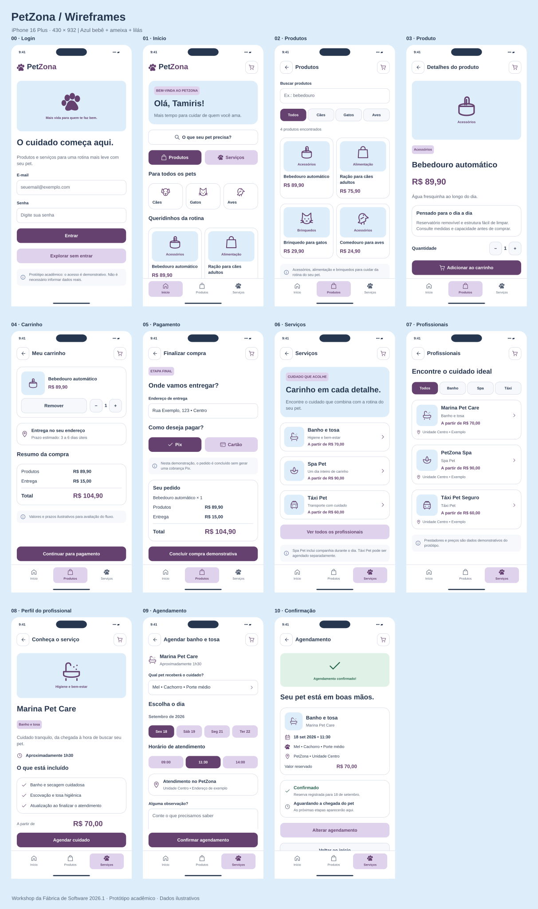

# 🐾 PetZona — Estudo de Caso Acadêmico de UX/UI

O **PetZona** foi desenvolvido como projeto final do **Workshop da Fábrica de Software 2026.1**.

O desafio fez parte do processo de avaliação para ingresso na equipe de **UX/UI do projeto Adm4All**, permitindo aplicar conhecimentos de pesquisa, jornada do usuário, arquitetura da informação, fluxos de navegação, wireframes e prototipação.

> **Status do projeto:** em evolução. As imagens apresentadas nesta página representam a direção visual esperada para a versão final de alta fidelidade no Figma. O protótipo navegável final ainda está em desenvolvimento.

---

## ✨ Visão do projeto

O PetZona foi pensado como uma solução digital para facilitar a rotina de tutores de animais, reunindo **produtos, serviços e acompanhamento da experiência** em um único ambiente.

A proposta considera principalmente pessoas com rotina intensa que precisam encontrar soluções práticas e confiáveis para cuidar de seus pets.

  

---

## 🎨 Resultado visual esperado

As telas abaixo representam o **resultado visual esperado para o protótipo final de alta fidelidade**.

### Fluxo de produtos — telas 01 a 05

O fluxo de produtos contempla:

1. Home;
2. Busca e resultados;
3. Detalhes do produto;
4. Carrinho;
5. Pagamento.

  

### Fluxo de serviços — telas 06 a 10

O fluxo de serviços contempla:

6. Descoberta de serviços;
7. Resultados de profissionais;
8. Perfil do profissional;
9. Agendamento de horário;
10. Confirmação e acompanhamento.

  

> As imagens acima funcionam como referência visual para a construção e organização das telas finais no Figma.

---

## 📌 Visão geral

| Item | Descrição |
|---|---|
| **Tipo de projeto** | Acadêmico — desafio final de workshop |
| **Área** | UX/UI Design |
| **Segmento** | Produtos e serviços para pets |
| **Responsabilidade** | Pesquisa exploratória, estruturação da experiência, fluxos e prototipação |
| **Ferramentas principais** | Figma e Miro |
| **Período** | 2026.1 |
| **Status atual** | Evolução da alta fidelidade e preparação do protótipo final no Figma |

---

## 🎯 O desafio

A atividade propôs a criação de uma solução digital com, no mínimo, três telas conectadas.

O processo deveria contemplar:

- definição de um perfil de usuário;
- mapeamento da jornada;
- organização do fluxo;
- protótipo de baixa fidelidade;
- evolução para alta fidelidade.

Para o desafio, escolhi desenvolver uma solução voltada ao segmento pet, considerando principalmente pessoas que precisam conciliar uma rotina intensa com os cuidados de seus animais.

---

## 💡 A proposta

O PetZona foi pensado para concentrar, em um único ambiente, recursos que facilitem a rotina dos tutores.

Entre as possibilidades trabalhadas no projeto estão:

- compra de alimentos, medicamentos, acessórios e outros produtos;
- busca por profissionais e serviços;
- agendamento de banho e tosa;
- atendimento veterinário;
- pet sitter;
- passeio;
- **Spa Pet**;
- **Táxi Pet**;
- avaliações de serviços;
- acompanhamento de pedidos e agendamentos.

Os recursos de **Spa Pet** e **Táxi Pet** foram incorporados à evolução do projeto para ampliar as possibilidades de cuidado e conveniência.

---

## 👤 Proto-persona

A proto-persona **Tamiris** representa uma tutora com rotina profissional intensa e três animais de estimação.

Ela procura principalmente:

- praticidade;
- economia de tempo;
- preços acessíveis;
- facilidade para encontrar produtos;
- profissionais e serviços confiáveis;
- acompanhamento dos pedidos e agendamentos;
- segurança ao deixar seus animais sob os cuidados de outras pessoas.

📄 **[Visualizar proto-persona](./persona-petzona.pdf)**

---

## 🗺️ Jornada do usuário

O mapeamento da jornada foi utilizado para organizar ações, necessidades, dificuldades e oportunidades ao longo da experiência.

Esse processo ajudou a estruturar o fluxo antes da criação das telas.

📄 **[Visualizar jornada do usuário](./jornada-do-cliente-petzona.pdf.pdf)**

---

## 🧩 UX/UI com perspectiva de Customer Experience

A evolução do PetZona não considera apenas a aparência das telas.

O projeto também observa elementos relacionados à **experiência do cliente**, como:

- clareza das informações;
- facilidade para encontrar produtos e serviços;
- redução de etapas desnecessárias;
- confiança na escolha de profissionais;
- acompanhamento de pedidos e agendamentos;
- confirmação das ações realizadas;
- continuidade da experiência após a contratação.

Essa perspectiva permite trabalhar o projeto não apenas como interface, mas também como uma jornada de relacionamento entre usuário, serviço e plataforma.

---

## 🔄 Fluxos principais

### Compra de produtos

1. Acesso à Home;
2. Busca ou escolha de categoria;
3. Visualização dos resultados;
4. Consulta dos detalhes do produto;
5. Adição ao carrinho;
6. Revisão do pedido;
7. Escolha da forma de pagamento;
8. Finalização da compra.

### Contratação de serviços

1. Acesso à área de serviços;
2. Escolha do serviço desejado;
3. Comparação de profissionais;
4. Visualização do perfil;
5. Consulta de avaliações e valores;
6. Escolha de data e horário;
7. Definição do local de atendimento;
8. Confirmação;
9. Acompanhamento do serviço.

---

## ✏️ Evolução do projeto

### 1. Esboços iniciais

As primeiras ideias foram desenhadas à mão para organizar a distribuição dos elementos e a sequência das telas.

  

### 2. Protótipo de baixa fidelidade

Os primeiros wireframes foram desenvolvidos para estruturar a arquitetura da informação e o fluxo de navegação antes da definição da identidade visual.

🔗 **[Acessar protótipo de baixa fidelidade no Figma](https://www.figma.com/design/vAmvuf2GjmCAnx36Vieos4/Sem-t%C3%ADtulo?node-id=0-1&p=f&t=tca6BgWprst7PPyQ-0)**

### 3. Evolução para alta fidelidade

A etapa atual trabalha:

- aplicação da identidade visual;
- definição de cores;
- imagens;
- tipografia;
- componentes;
- organização de estados;
- consistência entre telas;
- revisão dos principais fluxos.

As imagens apresentadas no início deste README representam a **referência visual esperada para essa evolução**.

### 4. Próxima etapa

A próxima etapa é reproduzir e organizar essas telas no Figma, conectando os fluxos para formar o protótipo navegável final.

---

## 🧱 Wireframes e materiais de apoio

O repositório também contém uma base de trabalho com **18 cenários de wireframes**, incluindo login, fluxo de compra e variações relacionadas a serviços como Spa Pet e Táxi Pet.

| Material | Acesso |
|---|---|
| Guia para abrir as telas e importar no Figma | [Comece aqui](./prototipos/wireframes/COMECE-AQUI.md) |
| Prévia interativa em HTML | [Petzona-preview.html](./prototipos/wireframes/Petzona-preview.html) |
| Telas individuais em SVG | [18 cenários](./prototipos/wireframes/telas-svg) |
| Gerador de camadas nativas com Auto Layout | [Plugin do Figma](./prototipos/wireframes/plugin) |
| Guia para correção de alinhamento | [Correção de alinhamento](./prototipos/wireframes/CORRIGIR-DESALINHAMENTO.md) |
| Código-fonte e verificações | [Fontes](./prototipos/wireframes/fontes) |

Para testar a prévia localmente:

1. baixe o repositório em **Code → Download ZIP**;
2. extraia os arquivos;
3. abra `prototipos/wireframes/Petzona-preview.html` no navegador.

> Compras, pagamentos, reservas e demais interações apresentadas na prévia são apenas demonstrações do projeto acadêmico.

### Visão geral dos wireframes

---

## 🛠️ Conhecimentos aplicados

- Proto-persona;
- Jornada do usuário;
- Arquitetura da informação;
- Fluxos de navegação;
- Esboços;
- Wireframes;
- Prototipação de baixa fidelidade;
- Evolução para alta fidelidade;
- Organização visual de interfaces;
- Hierarquia de informação;
- Princípios de usabilidade;
- Customer Experience aplicada à jornada;
- Figma;
- Miro.

---

## ♿ Próximos aprimoramentos

Entre os próximos passos previstos para o projeto estão:

- concluir as telas de alta fidelidade no Figma;
- conectar o protótipo navegável;
- criar um pequeno design system;
- revisar componentes e consistência visual;
- revisar acessibilidade;
- realizar testes de usabilidade;
- revisar pontos de atrito da jornada;
- evoluir os fluxos de Spa Pet e Táxi Pet;
- documentar os principais aprendizados e melhorias.

---

## ⚠️ Observação

O PetZona é um **projeto acadêmico e de estudo**.

As marcas, produtos, valores, profissionais, avaliações, endereços, pagamentos e demais informações utilizadas nas telas são apresentados apenas para fins de prototipação e demonstração da experiência.

O projeto não representa uma plataforma comercial em operação.

---

## 👩‍💻 Autora

**Priscilla Cahino**  
Estudante de Análise e Desenvolvimento de Sistemas  
UX/UI — Fábrica de Software | Adm4All

Este repositório apresenta o processo de construção e evolução do PetZona como parte da minha aprendizagem em tecnologia, UX/UI e experiência do cliente.
