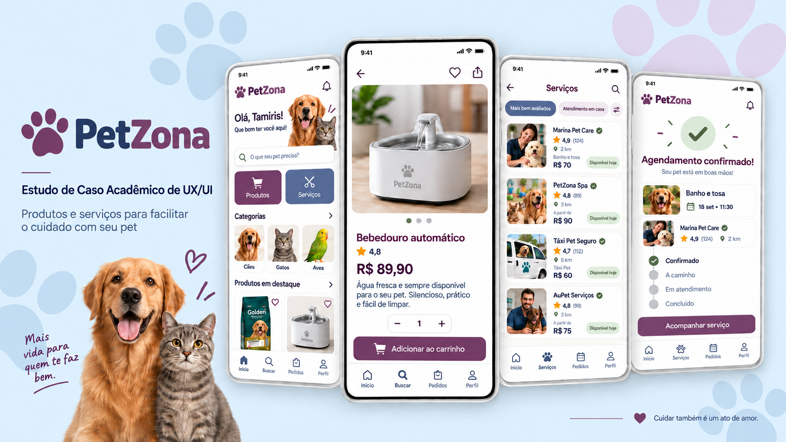
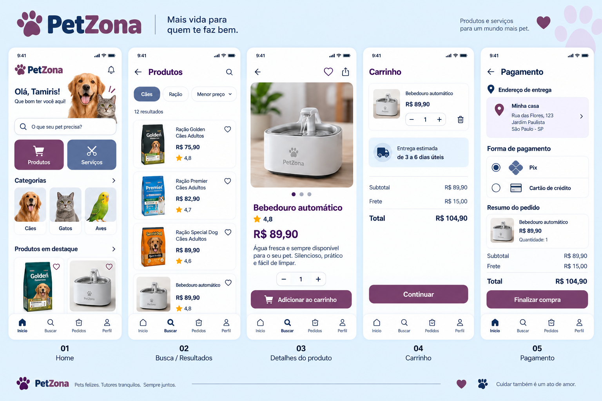
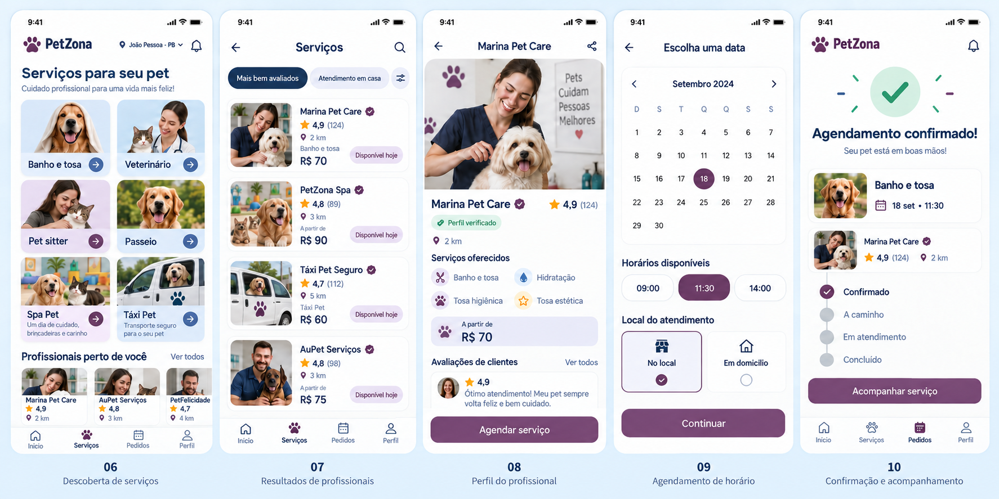

# 🐾 PetZona — Case Acadêmico de UX/UI

O **PetZona** é um projeto acadêmico de UX/UI desenvolvido durante a Imersão UX/UI da Fábrica de Software 2026.1, como parte do processo de ingresso na equipe de UX/UI do projeto Adm4All.

A proposta nasceu do desafio de pensar uma experiência digital que facilitasse a rotina de tutores de animais, reunindo produtos, serviços, agendamentos e acompanhamento da jornada do cliente em um único ambiente.

> **Status atual:** protótipo navegável de alta fidelidade concluído no Figma, com possibilidade de evolução a partir de testes de usabilidade e acessibilidade.

  

---

## 🎯 O desafio

A experiência de quem cuida de um animal muitas vezes envolve diferentes canais para encontrar produtos, pesquisar serviços, realizar agendamentos, acompanhar pedidos, contratar transporte e acompanhar serviços realizados no pet.

O desafio do PetZona foi organizar essas necessidades em uma experiência mais simples, intuitiva e centralizada.

---

## 💡 A proposta

O PetZona foi pensado como uma plataforma mobile que reúne diferentes necessidades do tutor em uma única jornada.

Entre os fluxos explorados estão:

- 🛍️ compra de produtos;
- 🐶 contratação de serviços;
- 📅 agendamentos;
- 🛁 Spa Pet;
- 🚕 Táxi Pet;
- 📦 acompanhamento de pedidos;
- 📍 acompanhamento de serviços;
- ❤️ experiência pós-atendimento.

A proposta considera a experiência do usuário **antes, durante e depois do serviço**.

---

## 🧩 Processo de UX/UI

**Persona → Jornada do usuário → Fluxos → Wireframes → Baixa fidelidade → Alta fidelidade → Protótipo navegável**

Durante o processo foram observados pontos como necessidades do usuário, clareza das informações, redução de atritos, organização dos fluxos, facilidade de navegação e confiança durante a contratação.

---

## 👤 Persona

A construção da persona ajudou a representar necessidades, comportamentos e dificuldades que poderiam surgir durante a utilização da plataforma.

📄 [Visualizar Persona](./persona-petzona.pdf)

---

## 🗺️ Jornada do usuário

A jornada foi utilizada para entender os diferentes pontos de contato entre o tutor e o serviço e identificar oportunidades de melhoria ao longo da experiência.

📄 [Visualizar Jornada do Usuário](./jornada-do-cliente-petzona.pdf.pdf)

> **Observação:** o nome do arquivo no repositório deve ser conferido. Caso o arquivo tenha apenas uma extensão `.pdf`, ajuste este link para `./jornada-do-cliente-petzona.pdf`.

---

## ✏️ Protótipo de baixa fidelidade

A baixa fidelidade foi utilizada para estruturar os primeiros fluxos e validar a distribuição das informações antes da aplicação da identidade visual.

🔗 [Acessar protótipo de baixa fidelidade no Figma](https://www.figma.com/design/vAmvuf2GjmCAnx36Vieos4/Sem-t%C3%ADtulo?node-id=0-1&p=f&t=tca6BgWprst7PPyQ-0)

---

## ✨ Protótipo de alta fidelidade

A etapa de alta fidelidade transformou os fluxos estruturados anteriormente em uma experiência visual mais próxima de um produto real.

🔗 **[▶️ Acessar o protótipo navegável de alta fidelidade no Figma](https://www.figma.com/proto/Ripqn3W1myctZpxt2WZKOI/Petzona?t=2pz6zE0tCU7RMyBX-1&scaling=min-zoom&content-scaling=fixed&page-id=0%3A1&node-id=6-2)**

---

## 🎨 Visão geral das telas

### 🛍️ Produtos

O fluxo de produtos trabalha a descoberta, visualização e continuidade da jornada de compra.

  

### 🐾 Serviços

Os fluxos de serviços foram pensados para facilitar a busca, contratação e acompanhamento das soluções oferecidas ao tutor e ao animal.

  

---

## 🧠 UX/UI com visão de Customer Experience

O PetZona foi desenvolvido não apenas pensando na interface, mas também na experiência completa do cliente.

Foram considerados:

- informações claras antes da contratação;
- redução de atritos;
- facilidade para localizar produtos e serviços;
- confiança durante agendamentos e pagamentos;
- acompanhamento do que foi contratado;
- continuidade da experiência após o atendimento;
- possibilidade de relacionamento e retenção.

Essa abordagem aproxima conceitos de **UX/UI, Customer Experience (CX) e Customer Success (CS)** dentro da mesma jornada.

---

## ♿ Acessibilidade

Durante a evolução da interface foram considerados princípios como hierarquia visual, contraste, legibilidade, tamanho das áreas de interação, consistência dos componentes e navegação previsível.

A acessibilidade continua sendo um dos pontos de evolução previstos para futuras validações.

---

## 🛠️ Ferramentas e conhecimentos utilizados

- Figma
- Miro
- UX/UI Design
- Prototipação
- Wireframes
- Alta fidelidade
- Fluxos de usuário
- Jornada do cliente
- Persona
- Heurísticas de usabilidade
- Acessibilidade
- Customer Experience (CX)

---

## 📌 Principais aprendizados

- transformar necessidades em fluxos;
- organizar informações de forma mais intuitiva;
- reduzir etapas e pontos de atrito;
- pensar na continuidade da jornada;
- manter consistência visual;
- relacionar UX/UI com experiência do cliente.

---

## 🚧 Próximas evoluções

- testes de usabilidade com usuários;
- validação dos principais fluxos;
- revisão aprofundada de acessibilidade;
- refinamento das microinterações;
- evolução do sistema de componentes;
- documentação mais detalhada do Design System;
- ajustes a partir dos resultados dos testes.

---

## 📚 Contexto acadêmico

Este projeto foi desenvolvido para fins de estudo, prática e apresentação de conhecimentos em UX/UI.

Valores, produtos, profissionais, serviços, formas de pagamento e estabelecimentos apresentados nas telas são utilizados apenas para fins demonstrativos dentro do protótipo.

---

## 👩‍💻 Responsável pelo projeto

**Priscilla Cahino**

Estudante de Análise e Desenvolvimento de Sistemas, com experiência profissional em relacionamento com clientes, atendimento, operações e processos, aplicando também conceitos de Customer Experience e Customer Success na construção de soluções digitais.

---

  <strong>🐾 PetZona — UX/UI pensado a partir da jornada de quem cuida.</strong>

